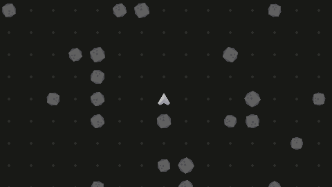

# Botnet
### A multiplayer programming simulation game

## Introduction
Botnet is a simulation game where each player writes a script to control autonomous units called "bots". Players have no control over the game directly, and must program their bots to play the game for them.

## Bot Scripts
Bots can be programmed in any language that can compile to [WebAssembly](https://webassembly.org).

Currently, the only SDK provided is for the [Rust](https://www.rust-lang.org) language. Depend on the [botnet_api](botnet_api) crate and compile a cdylib for the `wasm32-unknown-unknown` target.

Fork the [example bot](example_bot) to get started.

## Usage
Currently, the server is hardcoded to run several instances of the example bot.

To run the server with logs enabled, first compile the example bot:

`cargo build --release --manifest-path=example_bot/Cargo.toml`

and then compile and run the server:

`RUST_LOG=botnet cargo run --manifest-path=botnet/Cargo.toml`

To view the replay, run [BotnetReplayViewer](botnet_replay_viewer):

`cargo run --release --manifest-path=botnet_replay_viewer/Cargo.toml example.rplay`
